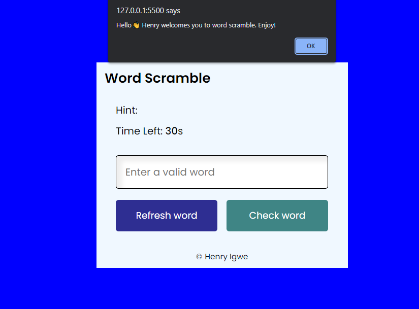

# ABOUT MY PROJECT

## Word Scramble

This is a word game that displays phrases in a disarranged manner, the player is expected to put the current word hence refresh and move the next phrase.

When no word check is supplied by the player, the correct word is displayed

### Built with

HTML
CSS
JAVASCRIPT

### Contact
Twitter: https://twitter.com/IgweHenr1

LinkedIn : https://linkedin.com/in/henryigwe

Projectlink: https://words-scramble.netlify.app/

### Acknowledgement 
I want to acknowledge web3bridge for hosting this cohort and also to be mentor Jola. She has been the best tutor to us.